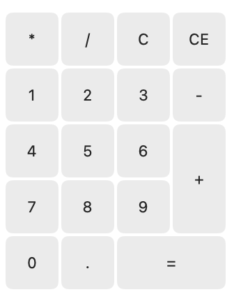

contents
+ calculator app
  + preview > 
+ javascript concepts
  - promise pattern
  + callback api prototype
- paddding in css

changelog
- make layout contain 2 flex-box elements (overflow only on botton row on longer "equals-sign" button)
+ appropriate class for number display/calculations
+ attach event listener to number-pad buttons
  - fix fractional point behavior / function
- add "parse last number" function, triggering after each operation button click (+, -, *, /)
- add "equals so far" function to trigger after each operation to calculate all previous operations after parsing the last number
- attach "equals" function to equals button
- add operation stack functionality
- reasearch uploading the project on superhosting.bg
- callback function and use cases
- promise functions and promise pattern in web programming
